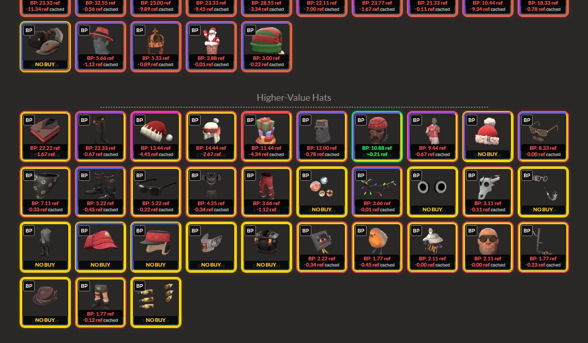

# TF2 ScrapTF Profit Helper

Advanced Scrap.tf trading helper for Team Fortress 2.

Compares Scrap.tf prices with Backpack.tf buy orders and shows real profit directly on item cards.

---

# Preview

---

# Features

- Live Backpack.tf buy order comparison
- Profit calculation directly on Scrap.tf
- Key + refined conversion support
- Strange / Vintage / Festivized support
- Painted item detection
- Killstreak support
- Scrap.tf unusual support
- Fast cached price loading
- Multiple item category support:
  - Hats
  - Items
  - Stranges
  - Skins
  - Killstreaks
  - Unusuals

---

# Installation

## 1. Install Tampermonkey

Chrome:
https://www.tampermonkey.net/

Firefox:
https://www.tampermonkey.net/

---

## 2. Install Script

[Install TF2 ScrapTF Profit Helper](https://raw.githubusercontent.com/VeBeshka/tf2-scraptf-profit-helper/main/tf2-scraptf-profit-helper.user.js)

---

# Supported Pages

- https://scrap.tf/buy/hats
- https://scrap.tf/buy/items
- https://scrap.tf/buy/stranges
- https://scrap.tf/buy/skins
- https://scrap.tf/buy/killstreaks
- https://scrap.tf/unusuals/*

---

# Русский

Вспомогательный инструмент для торговли в Team Fortress 2 на Scrap.tf.

Скрипт автоматически сравнивает цены Scrap.tf с buy orders на Backpack.tf и показывает прибыль прямо на предметах.

---

# Возможности

- Сравнение цен с Backpack.tf
- Автоматический подсчет прибыли
- Поддержка ключей и refined
- Поддержка:
  - Strange
  - Vintage
  - Festivized
  - Painted items
  - Killstreak
  - Unusual
- Быстрая загрузка цен
- Поддержка всех основных разделов Scrap.tf

---

# Установка

## 1. Установить Tampermonkey

https://www.tampermonkey.net/

---

## 2. Установить скрипт

[Установить TF2 ScrapTF Profit Helper](https://raw.githubusercontent.com/VeBeshka/tf2-scraptf-profit-helper/main/tf2-scraptf-profit-helper.user.js)

---

# Автор

VeBeshka
